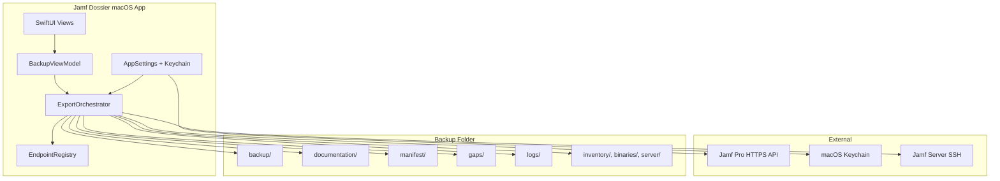
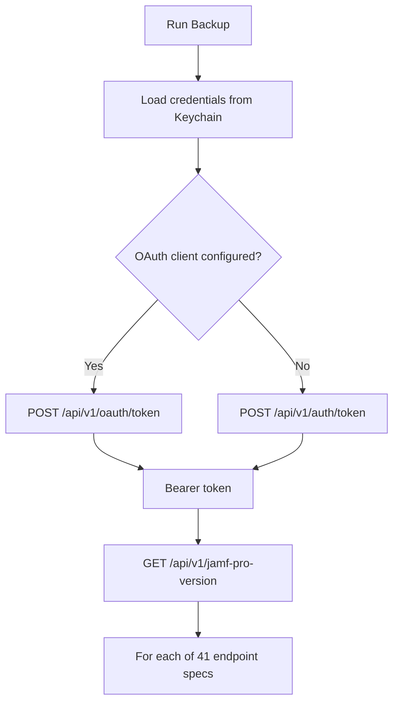
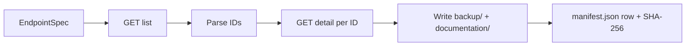
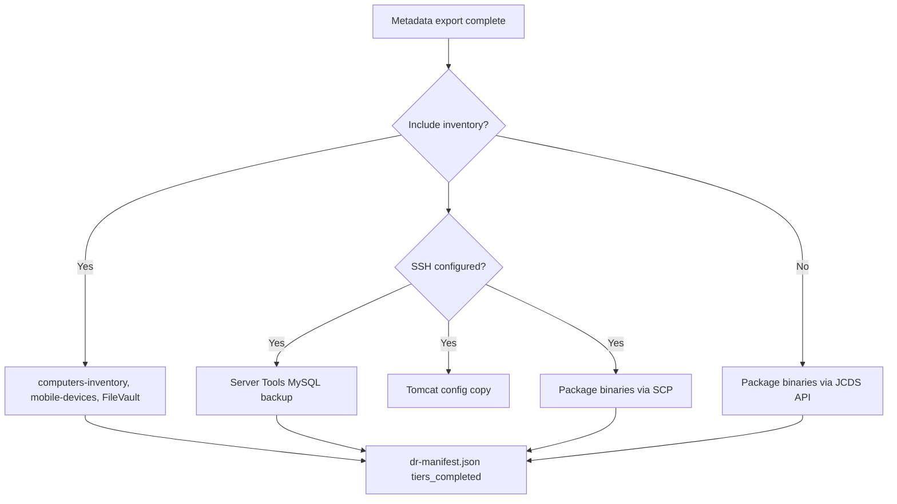

# Architecture

## System architecture

## Authentication flow

## Per-object collection

## Optional DR tiers

## Data flow summary

| Stage | Input | Output |
|-------|-------|--------|
| Auth | Keychain credentials | Bearer token |
| Collect | 41 API endpoints | `backup/`, `documentation/` |
| Inventory | JPAPI device endpoints | `inventory/` |
| Binaries | Package metadata + SSH or JCDS | `binaries/packages/` |
| Finalize | All records + errors | `manifest/`, `gaps/`, `logs/` |

## Repository vs application

| This repo | Shipped app |
|-----------|-------------|
| Documentation, CHANGELOG, release checksums | Signed `.app` in DMG |
| `endpoint_registry.json` reference copy | Registry inside app bundle |
| No Swift source | Proprietary binary |

## Related

- [Export Engine](export-engine.md)
- [Output Directory](output/index.md)
- [DR Overview](dr/README.md)
