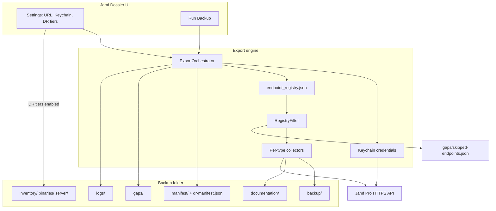

# Architecture

How **Jamf Dossier** collects Jamf Pro configuration and writes backup artifacts.

## System overview

## Authentication

1. Load OAuth or Basic credentials from Keychain
2. `POST /api/v1/oauth/token` or `POST /api/v1/auth/token`
3. Attach `Authorization: Bearer` on API requests
4. Refresh token once on HTTP 401 and retry

## Collection pipeline

1. Probe Jamf Pro version and deployment mode (cloud vs on-prem)
2. **RegistryFilter** skips expected-unavailable endpoints (JCDS on on-prem, probe 404s)
3. For each active registry entry: list → detail → write `backup/` + `documentation/`
4. Write manifest, DR manifest, gap report, failures, crosslinks

Skips are recorded in `gaps/skipped-endpoints.json`, not `logs/failures.json`.

## DR tiers (optional)

When enabled in Settings:

| Tier | Output |
|------|--------|
| Inventory | `inventory/` — computers, mobile devices, FileVault CSV |
| Package binaries | `binaries/` — `.pkg` files (cloud JCDS or on-prem SSH) |
| Server filesystem | `server/` — SSH probes (on-prem) |
| MySQL / Tomcat | `server/` — via Server Tools over SSH (on-prem) |

`manifest/dr-manifest.json` is written on **every** run; `tiers_completed` lists finished tiers.

## Related

- [Export Engine](export-engine.md)
- [Output Directory](output/index.md)
- [DR Overview](dr/README.md)
- [Operator Guide](jamf-dossier-operator-guide.md)
