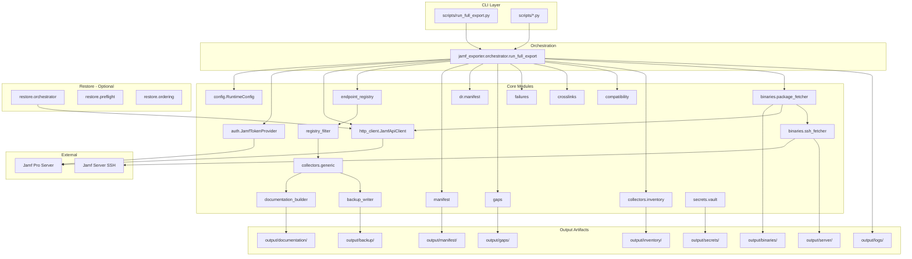
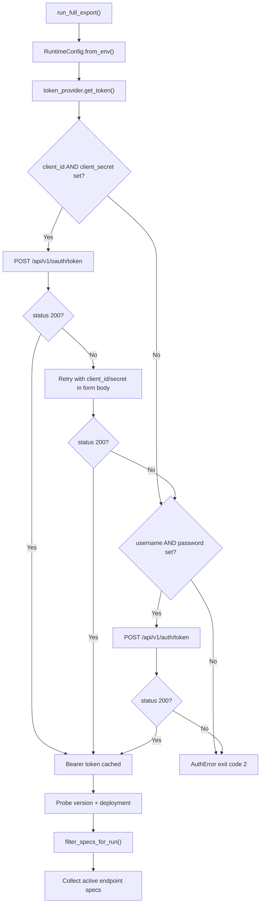
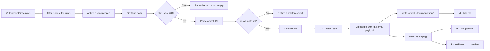
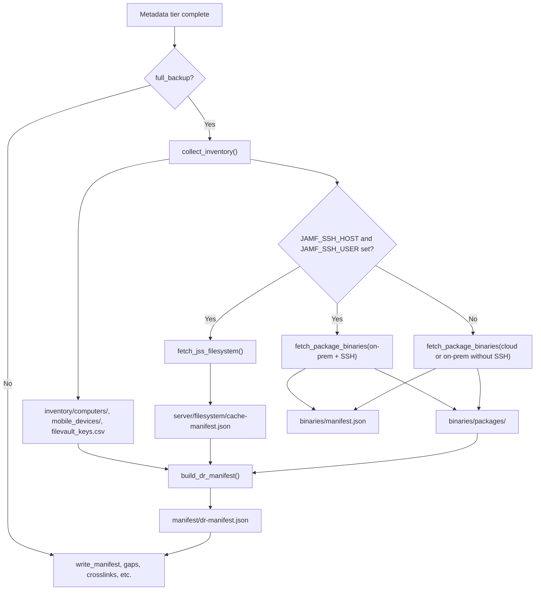
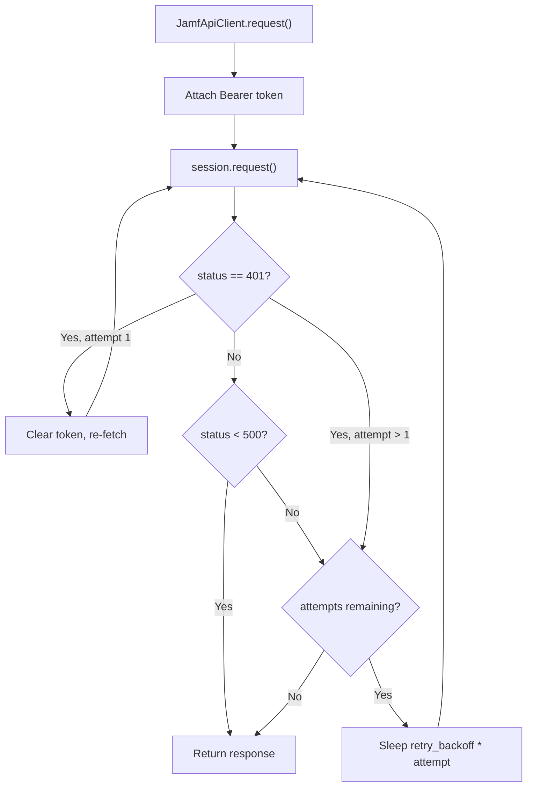
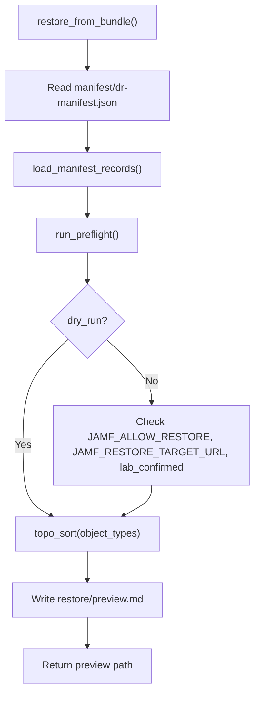

# Architecture

## System Architecture

## Authentication Flow

Source: `jamf_exporter/auth.py`, `jamf_exporter/orchestrator.py` lines 134–146.

## Per-Object Collection Pipeline

Source: `jamf_exporter/collectors/generic.py`, `jamf_exporter/documentation_builder.py`, `jamf_exporter/backup_writer.py`.

## Full Backup Tier Pipeline

When `full_backup=True` (CLI: `--full`; see [Usage Guide](usage-guide.md)):

Source: `jamf_exporter/orchestrator.py` lines 188–225.

## HTTP Client Retry Logic

Source: `jamf_exporter/http_client.py`.

## Restore Preview Flow

Source: `jamf_exporter/restore/orchestrator.py`.

## Exit Codes

| Code | Condition | Source |
|------|-----------|--------|
| `0` | Export completed with zero errors | `orchestrator.py` line 253 |
| `1` | Export completed but one or more collector/API errors occurred | `orchestrator.py` line 253 |
| `2` | Authentication preflight failed | `orchestrator.py` line 146 |

## Legacy vs Production Path

| Aspect | Production (`jamf_exporter/`) | Legacy (`src/`) |
|--------|-------------------------------|-----------------|
| Config | Environment variables | JSON config file |
| Auth | OAuth + Basic fallback | Basic-to-token only |
| Output layout | `output/documentation/`, `output/backup/` | `output/docs/`, `output/raw/` |
| Catalog | `endpoint_registry.py` (41 specs) | `config/endpoint_catalog.json` |
| DR bundle | Yes (v2.0) | No |
| Legacy mirrors | `raw/`, `docs/`, `manifests/`, `gap-report.md` | Primary paths |

The production path is invoked via `scripts/run_full_export.py`. Legacy scripts remain for reference but are not the recommended entrypoint.

Compatibility mapping is documented in `manifest/compatibility-spec.json` (produced by `jamf_exporter/compatibility.py`).
