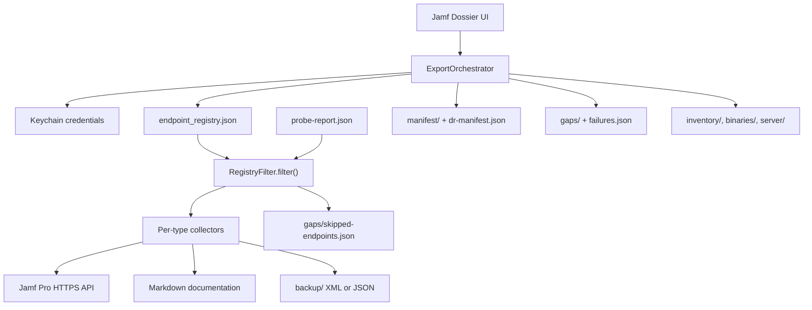

# Export Engine

How **Jamf Dossier** collects Jamf Pro configuration and writes backup artifacts. The app embeds the same export logic as the proprietary `jamf_exporter` engine (not published in this repository).

## Pipeline overview

## Authentication

1. Load OAuth client ID/secret or username/password from Keychain
2. `POST /api/v1/oauth/token` (OAuth) or `POST /api/v1/auth/token` (Basic)
3. Attach `Authorization: Bearer` on all API requests
4. On HTTP 401, refresh token once and retry

## Object collection (41 types)

For each entry in the bundled endpoint registry:

1. `GET` list endpoint (Classic API XML or Jamf Pro API JSON)
2. Parse object IDs (or treat as singleton when no detail path)
3. `GET` detail endpoint per ID
4. Write `backup/{type}/{id}__{name}.{xml|json}`
5. Write `documentation/{type}/{id}__{name}.md` with plain-text extractors (script source, policy scope, criteria prose) plus raw payload summary
6. Append row to `manifest/manifest.json` with SHA-256 checksum

Before collection, **RegistryFilter** (Python: `filter_specs_for_run`) skips expected-unavailable endpoints (JCDS on on-prem, probe 404s). Skips are recorded in `gaps/skipped-endpoints.json`, not `failures.json`.

Registry is shipped inside the app bundle as `endpoint_registry.json` (41 endpoints, 2 manual gaps).

## DR Bundle v2.0 directories

Created on every run; populated when optional tiers are enabled in Settings:

| Directory | When populated |
|-----------|----------------|
| `backup/`, `documentation/`, `manifest/`, `gaps/`, `logs/` | Every successful metadata export |
| `inventory/` | Device inventory tier enabled |
| `binaries/packages/` | Package binary fetch enabled (cloud API or on-prem SSH) |
| `server/` | On-prem SSH: MySQL dump, Tomcat configs, filesystem manifest |
| `secrets/` | Encrypted vault when secrets are captured |
| `captures/` | Reserved for manual operator attachments |

`manifest/dr-manifest.json` is written on **every** export (metadata tier minimum). It records `bundle_version` (`2.0`), Jamf Pro version, deployment mode (`cloud` / `on_prem`), and `tiers_completed`.

## App settings that affect export

| Setting | Effect |
|---------|--------|
| **Backup all** / selected types | Limits which registry entries are collected |
| **Stop on first 401** | Stops loop after first permission error |
| **Verify TLS** | Enables/disables certificate validation |
| **Timestamped subfolder** | Writes under `YYYY-MM-DDTHHMMSSZ/` |
| **Include MySQL backup** | On-prem SSH + Server Tools database backup |
| **Include Tomcat configuration** | SSH copy of Tomcat config files |
| **Include inventory** | Computers, mobile devices, FileVault keys |

## Exit behavior

The app reports success or partial success in the UI. Check `gaps/manual-workarounds.md` for manual gaps and expected-unavailable skips; use `logs/failures.json` only for unexpected runtime errors (401, parse failures, etc.).

## Legacy compatibility paths

Each run also mirrors artifacts for older tooling:

| Legacy path | Current path |
|-------------|--------------|
| `raw/` | `backup/` |
| `docs/` | `documentation/` |
| `manifests/` | `manifest/` |
| `gap-report.md` | `gaps/manual-workarounds.md` |

See `manifest/compatibility-spec.json` in the backup folder.

## Related

- [Output Directory Index](output/index.md)
- [Architecture](architecture.md)
- [API Endpoint Citations](api-endpoint-citations.md)
