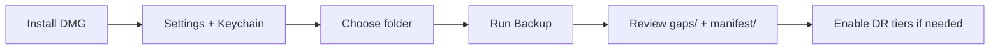

# Getting Started

User documentation for the **Jamf Dossier** macOS application.

## Quick path

## 1. Install the app

1. Open [GitHub Releases](https://github.com/roto31/jamf-dossier/releases)
2. Download `Jamf Dossier-<version>-macos.dmg` (use **v0.1.2 or newer**; avoid `v0.1.1`)
3. Open the DMG and drag **Jamf Dossier** to **Applications**
4. On first launch, allow the app if macOS Gatekeeper prompts (signed Developer ID build)

Optional: verify SHA-256 against `release/<version>/checksums.sha256` in this repository.

## 2. Configure Jamf Pro

1. Open **Jamf Dossier** → open **Settings** (gear menu or Settings window)
2. **Jamf Pro URL** — base URL only, e.g. `https://yourtenant.jamfcloud.com` or `https://jamf.example.com:8443`
3. **API credentials** — choose one:
   - **OAuth:** Client ID + Client Secret → **Save to Keychain**
   - **Basic:** API username + password → **Save to Keychain**
4. **Verify TLS certificates** — leave on for production; turn off only for lab appliances with self-signed certs

Create API credentials in Jamf Pro: **Settings → System Settings → API Roles and Clients**. Assign a role with **Read** on object types you need.

## 3. Choose backup destination

1. On the main screen, click **Choose Folder…**
2. Select or create a folder (external drive recommended for large backups)
3. Optionally enable **Create timestamped subfolder** for each run

macOS stores a security-scoped bookmark so the app can write to this folder on future launches.

## 4. Review coverage

Open **API Coverage** in the sidebar to see:

- **41** automated object types from the bundled endpoint registry
- **Manual gaps** (SSO configuration, API integration secrets) requiring UI documentation

Open **DR Coverage** to see which disaster-recovery tiers apply to your deployment (cloud vs on-prem).

## 5. Run backup

1. Select object types (or leave **Backup all** enabled)
2. Optional: **Stop on first 401** — stops at the first permission error (useful for RBAC tuning)
3. Click **Run Backup** → confirm destination and scope
4. Watch progress; open **Reveal in Finder** when complete

## 6. Review results

| Path in backup folder | What to check |
|----------------------|---------------|
| `manifest/run-metadata.json` | Object counts, errors, missing privileges |
| `manifest/dr-manifest.json` | DR bundle metadata (every run) |
| `gaps/skipped-endpoints.json` | Expected-unavailable endpoints (not failures) |
| `gaps/manual-workarounds.md` | API gaps, Expected Unavailable, runtime errors |
| `documentation/` | Human-readable per-object docs |
| `backup/` | Raw XML/JSON for diff and restore planning |
| `logs/failures.json` | Actionable failures only |
| `logs/export.log` | Detailed run log |

## On-premises extras

For on-prem Jamf Pro servers, optional tiers in **Settings**:

- **Include MySQL backup** — requires SSH + Server Tools 2.7.10+
- **Include Tomcat configuration** — copies Tomcat config via SSH
- **SSH host, port, username** — save SSH password or import private key to Keychain

See [Operator Guide](jamf-dossier-operator-guide.md).

## Next steps

- [Usage Guide](usage-guide.md) — advanced options and re-runs
- [Troubleshooting](troubleshooting.md) — HTTP 401, TLS, connectivity
- [DR Overview](dr/README.md) — full DR bundle and restore planning
