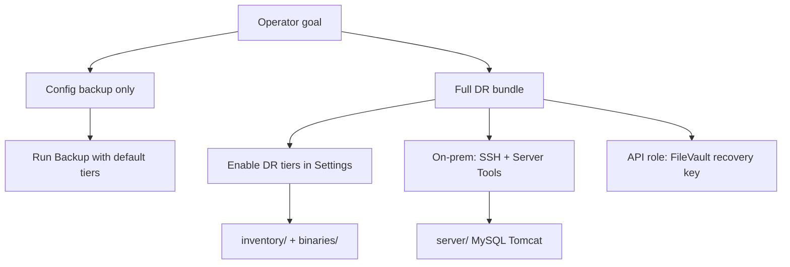

# Jamf Dossier operator guide

## Backup scope

## Install

Download the signed `.dmg` from [GitHub Releases](https://github.com/roto31/jamf-dossier/releases) and drag **Jamf Dossier** to Applications.

## First run

1. Open **Settings** and enter Jamf Pro URL.
2. Save OAuth client credentials (or username/password) to Keychain.
3. Choose a backup destination folder.
4. Review **API Coverage** for exported object types and manual gaps.
5. Review **DR Coverage** for tier availability on your deployment.

## Config vs full DR

| Mode | Settings | Output |
|------|----------|--------|
| Config only | Default tiers | `backup/`, `documentation/`, `manifest/`, `gaps/`, `logs/` |
| Full DR | Enable inventory, binaries, MySQL/Tomcat as applicable | Adds `inventory/`, `binaries/`, `server/` |

`manifest/dr-manifest.json` is written on every run.

## On-premises database backup

Requires SSH to the Jamf Pro server, Server Tools **2.7.10+**, and SSH credentials in Settings.

1. Enter **SSH host**, **port** (usually 22), and **username** (`jamfadmin`).
2. Click **Save SSH password to Keychain** (or **Import SSH private key**).
3. Click **Save MySQL password to Keychain** (Jamf Pro database user from `DataBase.xml`, usually `jamfsoftware`).
4. Enable **Include MySQL backup** and/or **Include Tomcat configuration files**.

If SSH works in Terminal but the app failed with `Permission denied (publickey,password)`, ensure the password was saved to Keychain after typing it, or use a key.

## Expected skips (v0.4.0)

JCDS and probe-unavailable endpoints appear in `gaps/skipped-endpoints.json` — not in `logs/failures.json`. See [Troubleshooting](troubleshooting.md).

## Known release issues

- **`v0.1.1` DMG** — crashes on launch. Use **v0.1.2 or newer**.

## Troubleshooting

| Symptom | Action |
|---------|--------|
| **"Internet connection appears to be offline"** | Fix **Jamf URL** + **API** Keychain credentials (not SSH) |
| HTTP 401 | Grant API Read privileges; enable **Stop on first 401** |
| TLS errors | Toggle **Verify TLS** off only for lab self-signed certs |
| Empty Plain Text sections | Re-run after v0.4.0+ upgrade |

## Related

- [Getting Started](getting-started.md)
- [DR Overview](dr/README.md)
- [Troubleshooting](troubleshooting.md)
- [DR Bundle Directories](output/dr-bundle-directories.md)
