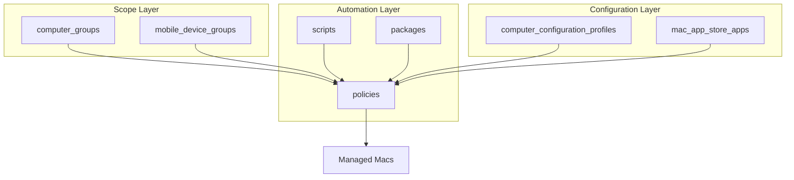
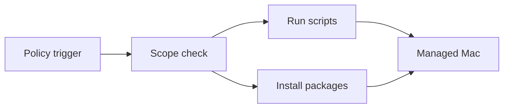

# Jamf Object Architecture

How exported object types interact on the Lotus Home Academy Jamf Pro server.

## Layer Descriptions

| Layer | Object Types | Purpose |
|-------|--------------|---------|
| Scope | computer_groups, mobile_device_groups | Define which devices receive policies and profiles |
| Configuration | computer_configuration_profiles, mac_app_store_apps | MDM payloads and App Store titles |
| Automation | policies, scripts, packages | Execute tasks on scoped devices |

## Policy Execution Flow

Source: Derived from exported policy XML (scripts, packages, scope sections) and [`crosslinks.md`](relationships/crosslinks.md).

## Related

- [Policy Crosslinks](relationships/crosslinks.md)
- [Policies catalog](object-types/policies.md)
