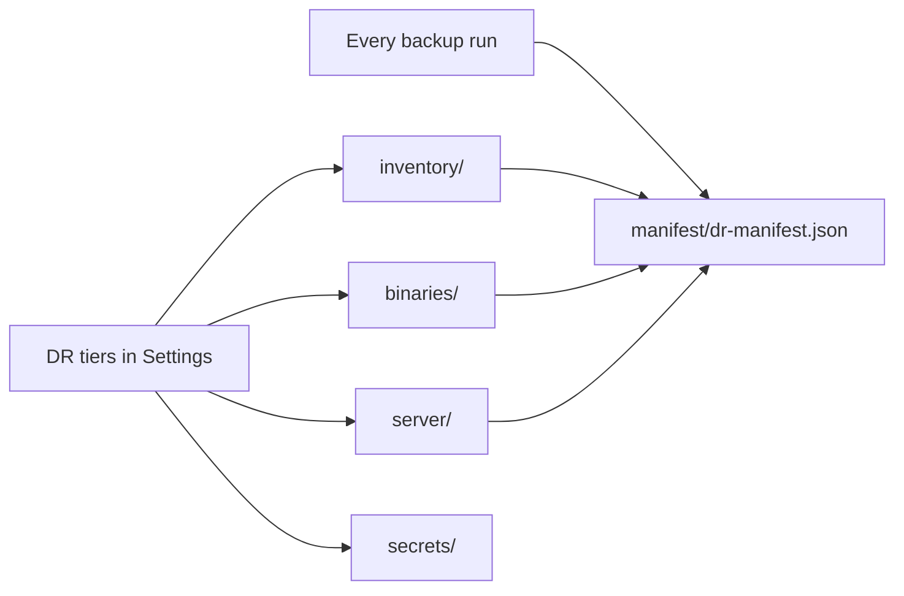

# DR Bundle Directories

Optional disaster-recovery tiers beyond configuration metadata.

**Paths:** `inventory/`, `binaries/`, `server/`, `secrets/`, `captures/`

Directories are created on every run. Content is populated when DR tiers are enabled in **Settings** (DR Coverage view).

`manifest/dr-manifest.json` is written on **every** run.

## Tier overview

## inventory/

Device-level exports: computers, mobile devices, FileVault recovery keys (when privileged).

Requires **Computers: Read**; FileVault CSV requires **View Disk Encryption Recovery Key**.

## binaries/

Package `.pkg` files referenced by exported package metadata.

| Deployment | Requirement |
|------------|-------------|
| Cloud | JCDS download URLs |
| On-prem | SSH to Jamf Pro server for package cache |

## server/

On-prem only: MySQL backup via Server Tools, Tomcat configuration, filesystem probes. Requires SSH credentials in Settings.

## secrets/

AES-256-GCM encrypted vault when used. See [Secrets Vault](../dr/secrets-vault.md).

## captures/

Reserved for manual operator captures (screenshots, UI exports).

## Related

- [DR Overview](../dr/README.md)
- [Operator Guide](../jamf-dossier-operator-guide.md)
- [Output Directory](index.md)
