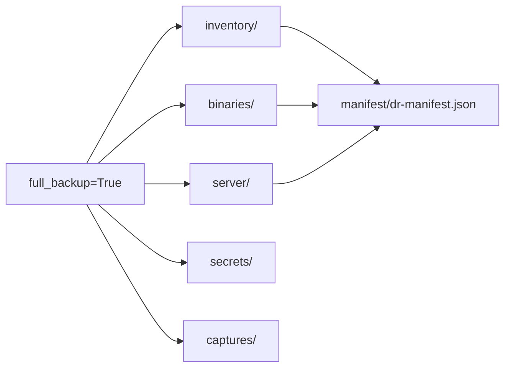

# DR Bundle Directories

**Paths:** `output/binaries/`, `output/inventory/`, `output/server/`, `output/secrets/`, `output/captures/`

These directories are part of **DR Bundle v2.0** (`BUNDLE_VERSION = "2.0"` in `jamf_exporter/dr/schema.py`). They are created as empty directories on every export via `_ensure_bundle_dirs()`. Content is populated only when `run_full_export(..., full_backup=True)` is used.

> **Note:** The CLI (`scripts/run_full_export.py`) does not expose `--full-backup` yet. Use the Python API or tests to enable full backup tiers.

## Directory Overview



---

## inventory/

**Produced by:** `jamf_exporter/collectors/inventory.py` → `collect_inventory()`

Device-level inventory export for disaster recovery planning.

### Structure

```
output/inventory/
├── computers/
│   └── {id}.json          # One JSON file per managed computer
├── mobile_devices/
│   └── {id}.json          # One JSON file per mobile device
└── filevault_keys.csv     # FileVault recovery keys (if privileged)
```

### computers/

- **Source endpoint:** `GET /api/v1/computers-inventory` (paginated, page-size 100)
- **Format:** Pretty-printed JSON per device ID
- **Privilege required:** Computers: Read
- **On 401/403:** Writes `gaps/computers-inventory-privilege-missing.md` and records error

### mobile_devices/

- **Source endpoint:** `GET /api/v2/mobile-devices` (paginated)
- **Format:** Pretty-printed JSON per device ID
- **Privilege required:** Mobile Devices: Read

### filevault_keys.csv

- **Source endpoint:** `GET /api/v1/computers-inventory/filevault`
- **Format:** CSV with FileVault recovery key data
- **Privilege required:** Computers: Read + "View Disk Encryption Recovery Key"
- **On failure:** Writes `gaps/filevault-privilege-missing.md`

---

## binaries/

**Produced by:** `jamf_exporter/binaries/package_fetcher.py`

Package binary (`.pkg`) files referenced by exported package metadata.

### Structure

```
output/binaries/
├── packages/
│   └── {id}__{filename}   # Package binary files
└── manifest.json          # Fetch results summary
```

### Fetch Modes

| Deployment | SSH configured | Method |
|------------|----------------|--------|
| Cloud | N/A | `fetch_package_binaries_cloud()` via JCDS download URLs |
| On-prem | Yes | `fetch_package_binaries_onprem()` via SCP from JSS package cache |
| On-prem | No | Skips binary fetch; writes `gaps/package-binaries-ssh-required.md` |

### binaries/manifest.json

Summary of fetch results:

| Field | Description |
|-------|-------------|
| `fetched` | Count of newly downloaded packages |
| `skipped` | Count of packages already present locally |
| `errors` | List of fetch error dicts |

### SSH Environment Variables

| Variable | Default | Description |
|----------|---------|-------------|
| `JAMF_SSH_HOST` | — | Jamf Pro server hostname |
| `JAMF_SSH_USER` | — | SSH username |
| `JAMF_SSH_PORT` | `22` | SSH port |
| `JAMF_SSH_IDENTITY_FILE` | — | Path to SSH private key |

Source: `jamf_exporter/orchestrator.py` lines 194–224.

---

## server/

**Produced by:** `jamf_exporter/binaries/ssh_fetcher.py` → `fetch_jss_filesystem()`

On-prem server filesystem probes. Requires SSH configuration (same env vars as binaries on-prem fetch).

### Structure

```
output/server/
└── filesystem/
    ├── cache-manifest.json    # Remote file listing metadata
    └── packages/              # Reserved for cached package copies
```

Only runs when `full_backup=True` and both `JAMF_SSH_HOST` and `JAMF_SSH_USER` are set.

---

## secrets/

**Produced by:** `jamf_exporter/secrets/vault.py` → `Vault.save()`

AES-256-GCM encrypted secrets store for DR scenarios where API secrets cannot be exported in cleartext.

### Structure

```
output/secrets/
├── vault.enc           # Encrypted blob (AES-256-GCM)
└── vault-index.json    # Key → entry UUID mapping (no cleartext values)
```

### Environment

| Variable | Required | Description |
|----------|----------|-------------|
| `JAMF_DR_PASSPHRASE` | Yes (for encrypt/decrypt) | Passphrase for PBKDF2 key derivation |

See [Secrets Vault](../dr/secrets-vault.md) for encryption details.

---

## captures/

**Reserved directory** for manual operator captures (screenshots, UI exports, SSO config notes). Created empty by `_ensure_bundle_dirs()`. No automated writer currently populates this directory.

---

## DR Manifest Integration

When any full-backup tier completes, `tiers_completed` in `manifest/dr-manifest.json` is updated:

| Tier value | Trigger |
|------------|---------|
| `metadata` | Always (standard config export) |
| `inventory` | At least one inventory collector returned data |
| `server_filesystem` | SSH filesystem probe succeeded |
| `binaries` | At least one package binary fetched |

Example `dr-manifest.json`:

```json
{
  "bundle_version": "2.0",
  "created_at": "2026-06-02T21:00:00+00:00",
  "deployment_mode": "on_prem",
  "jamf_pro_version": "11.12.0",
  "restore_order": ["sites", "categories", "scripts", "..."],
  "source_jamf_url": "https://jamf.example.com:8443",
  "tiers_completed": ["metadata", "inventory", "binaries"]
}
```

Source: `jamf_exporter/dr/manifest.py`, `jamf_exporter/dr/schema.py`.

## Related

- [Output Directory Index](index.md)
- [DR Overview](../dr/README.md)
- [Usage Guide](../usage-guide.md#full-backup-tier-python-api)
