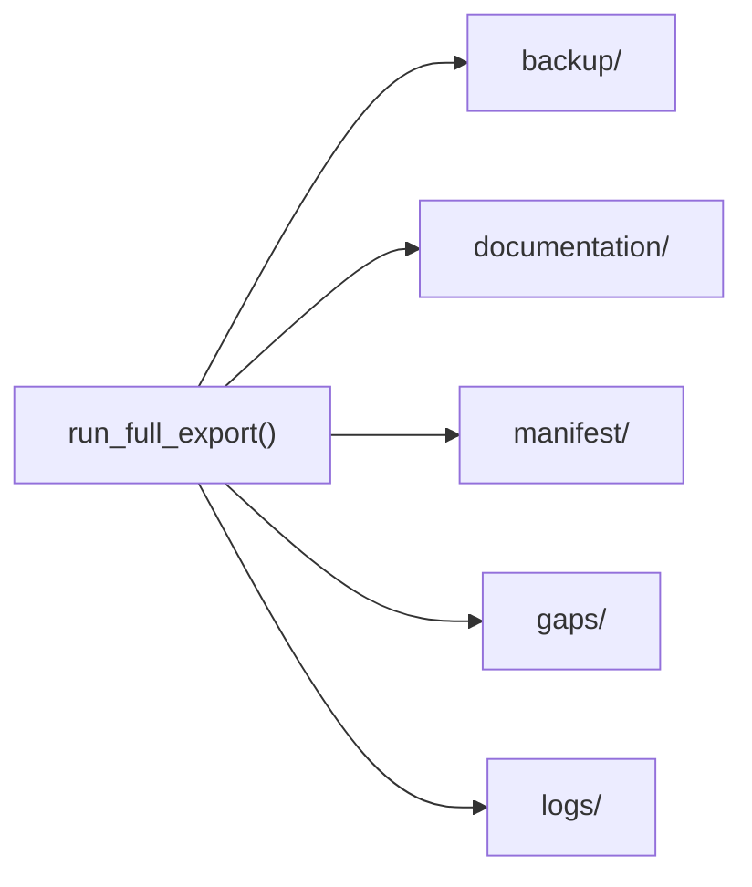

# Output Directory Index

The `--output` flag (default `output`) controls the user-selected destination where all backups, generated documentation, manifests, and logs are written. The directory is gitignored and recreated/updated on each run.

## Top-Level Structure

```
output/
├── backup/              # Raw JSON/XML object payloads
├── documentation/       # Human-readable Markdown docs
├── manifest/            # Inventory and run metadata
├── gaps/                # Manual workaround report
└── logs/                # Export log file
```

Legacy-compatibility artifacts are mirrored alongside the primary layout:

```
output/
├── raw/                 # Mirrors backup/
├── docs/                # Mirrors documentation/
├── manifests/           # Mirrors manifest/
├── gap-report.md        # Mirrors gaps/manual-workarounds.md
└── logs/failures.json   # Structured failure report
```



## Produced By

| Artifact | Module / Function |
|----------|-------------------|
| `backup/` | `backup_writer.write_backups()` |
| `documentation/` | `documentation_builder.write_object_documentation()` |
| `documentation/crosslinks.md` | `crosslinks.write_crosslink_report()` |
| `documentation/api-endpoint-citations.md` | `orchestrator.write_endpoint_citations()` |
| `manifest/manifest.json`, `manifest.csv` | `manifest.write_manifest()` |
| `manifest/run-metadata.json` | `orchestrator.write_run_metadata()` |
| `gaps/manual-workarounds.md` | `gaps.write_gap_report()` |
| `logs/export.log` | `logging_utils.build_logger()` |

## Subpages

| Page | Content |
|------|---------|
| [backup/](backup-directory.md) | Per-type raw exports |
| [documentation/](documentation-directory.md) | Markdown docs and crosslinks |
| [manifest/, gaps/, logs/](manifest-gaps-logs.md) | Inventory, gaps, logging |

## Interpretation Notes

- Partial exports are valid when RBAC blocks some endpoints or `--stop-on-401` is used
- Object counts per type are in `manifest/run-metadata.json` → `object_counts`
- Check `error_count` and `missing_privileges_by_endpoint` in run metadata for completeness assessment

## Folder Indexes (Item Catalogs)

Each folder under `output/` includes a `README.md` describing the folder and listing every exported item with a one-line summary:

| Path | Contents |
|------|----------|
| `output/README.md` | Snapshot overview and links to all subfolders |
| `output/backup/README.md` | Index of all backup object types |
| `output/backup/<type>/README.md` | Per-item table: Jamf ID, name, file link, summary |
| `output/documentation/README.md` | Index of documentation artifacts and object types |
| `output/documentation/<type>/README.md` | Same catalog with links to per-object `.md` files |
| `output/manifest/README.md` | Describes manifest files and run summary |
| `output/gaps/README.md` | Describes gap report contents |
| `output/logs/README.md` | Describes export log |

Regenerate indexes after a new export:

```bash
python scripts/generate_output_indexes.py --output output
```
