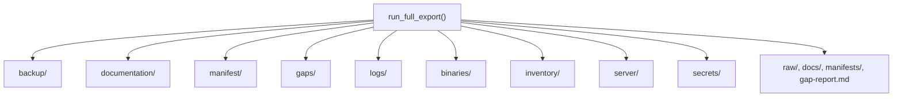

# Output Directory Index

The `--output` flag (default `output`) controls the user-selected destination where all backups, generated documentation, manifests, and logs are written. The directory is gitignored and recreated/updated on each run.

## Top-Level Structure (DR Bundle v2.0)

```
output/
├── backup/              # Raw JSON/XML object payloads
├── documentation/       # Human-readable Markdown docs
├── manifest/            # Inventory, DR manifest, run metadata, compatibility
├── gaps/                # Manual workaround and privilege gap reports
├── logs/                # Export log and structured failures
├── binaries/            # Package .pkg files (full_backup tier)
├── inventory/           # Device inventory JSON and FileVault CSV (full_backup tier)
├── server/              # JSS filesystem probes (full_backup + SSH)
├── secrets/             # Encrypted vault (when used)
├── captures/            # Manual operator captures (reserved)
└── restore/             # Restore preview and id-map (when restore run)
```

Legacy-compatibility artifacts are mirrored alongside the primary layout:

```
output/
├── raw/                 # Mirrors backup/
├── docs/                # Mirrors documentation/
├── manifests/           # Mirrors manifest/
├── gap-report.md        # Mirrors gaps/manual-workarounds.md
└── logs/failures.json   # Structured failure report
```



## Produced By

| Artifact | Module / Function |
|----------|-------------------|
| `backup/` | `backup_writer.write_backups()` |
| `raw/` | `backup_writer.write_backups()` (legacy mirror) |
| `documentation/` | `documentation_builder.write_object_documentation()` |
| `docs/` | `documentation_builder.write_legacy_overview()` |
| `documentation/crosslinks.md` | `crosslinks.write_crosslink_report()` |
| `documentation/api-endpoint-citations.md` | `orchestrator.write_endpoint_citations()` |
| `manifest/manifest.json`, `manifest.csv` | `manifest.write_manifest()` |
| `manifest/run-metadata.json` | `orchestrator.write_run_metadata()` |
| `manifest/dr-manifest.json` | `dr.manifest.write_dr_manifest()` |
| `manifest/compatibility-spec.json` | `compatibility.write_compatibility_spec()` |
| `manifest/output-compatibility.csv` | `compatibility.write_compatibility_spec()` |
| `manifests/*` | manifest + compatibility (legacy mirror) |
| `gaps/manual-workarounds.md` | `gaps.write_gap_report()` |
| `gap-report.md` | `gaps.write_gap_report()` (legacy mirror) |
| `logs/export.log` | `logging_utils.build_logger()` |
| `logs/failures.json` | `failures.write_failure_report()` |
| `inventory/*` | `collectors.inventory.collect_inventory()` (full_backup) |
| `binaries/*` | `binaries.package_fetcher` (full_backup) |
| `server/*` | `binaries.ssh_fetcher.fetch_jss_filesystem()` (full_backup + SSH) |
| `secrets/*` | `secrets.vault.Vault.save()` (when used) |
| `restore/preview.md` | `restore.orchestrator.restore_from_bundle()` |

## Subpages

| Page | Content |
|------|---------|
| [backup/](backup-directory.md) | Per-type raw exports |
| [documentation/](documentation-directory.md) | Markdown docs and crosslinks |
| [manifest/, gaps/, logs/](manifest-gaps-logs.md) | Inventory, gaps, logging |
| [DR Bundle Directories](dr-bundle-directories.md) | binaries, inventory, server, secrets, captures |

## Interpretation Notes

- Partial exports are valid when RBAC blocks some endpoints or `--stop-on-401` is used
- Object counts per type are in `manifest/run-metadata.json` → `object_counts`
- Check `error_count` and `missing_privileges_by_endpoint` for completeness assessment
- `manifest/dr-manifest.json` → `tiers_completed` shows which DR tiers succeeded
- `binaries/`, `inventory/`, `server/` may be empty on standard (non-full) exports

## Folder Indexes (Item Catalogs)

Regenerate after a new export:

```bash
python scripts/generate_output_indexes.py --output output
```

Creates README files at:

| Path | Contents |
|------|----------|
| `output/README.md` | Snapshot overview |
| `output/backup/README.md` | Index of all backup object types |
| `output/backup/<type>/README.md` | Per-item table with Jamf ID, name, file link |
| `output/documentation/README.md` | Documentation artifacts index |
| `output/documentation/<type>/README.md` | Links to per-object `.md` files |
| `output/manifest/README.md` | Manifest files and run summary |
| `output/gaps/README.md` | Gap report contents |
| `output/logs/README.md` | Export log description |

Source: `jamf_exporter/output_indexes.py`.
