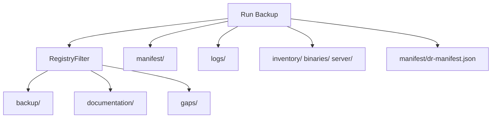

# Output Directory

Jamf Dossier writes all backup artifacts under the folder you choose (optionally in a timestamped subfolder).

## Top-level layout

```
backup-folder/
├── backup/              # Raw JSON/XML object payloads
├── documentation/       # Human-readable Markdown docs
├── manifest/            # Inventory, DR manifest, run metadata
├── gaps/                # Skips, privilege gaps, manual workarounds
├── logs/                # Export log and failures.json
├── binaries/            # Package .pkg files (DR tier)
├── inventory/           # Device inventory (DR tier)
├── server/              # MySQL/Tomcat/SSH probes (DR tier)
├── secrets/             # Encrypted vault (when used)
└── captures/            # Manual operator captures (reserved)
```



## Subpages

| Page | Content |
|------|---------|
| [backup/](backup-directory.md) | Raw XML/JSON exports |
| [documentation/](documentation-directory.md) | Per-object Markdown |
| [manifest, gaps, logs](manifest-gaps-logs.md) | Inventory and run metadata |
| [DR Bundle Directories](dr-bundle-directories.md) | Optional DR tiers |

## Related

- [Getting Started](../getting-started.md)
- [Usage Guide](../usage-guide.md)
- [Export Engine](../export-engine.md)
