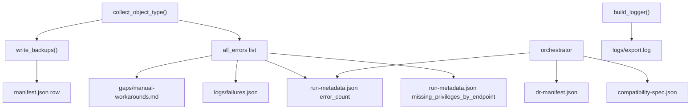

# manifest/, gaps/, and logs/

## manifest/

**Path:** `output/manifest/`

Inventory, DR metadata, and run statistics for the export.

### manifest.json

**Produced by:** `manifest.write_manifest()`

JSON array of export records. Each element matches `ExportRecord` dataclass:

| Field | Type | Description |
|-------|------|-------------|
| `object_type` | string | Jamf object class |
| `jamf_id` | string | Object ID |
| `name` | string | Display name |
| `source_endpoint` | string | Detail or list API path template |
| `method` | string | HTTP method (GET) |
| `output_format` | string | `xml` or `json` |
| `file_path` | string | Path to backup file |
| `checksum_sha256` | string | SHA-256 of backup file content |
| `exported_at_utc` | string | ISO 8601 UTC timestamp |
| `status` | string | `success` (default) |
| `error` | string \| null | Error message if failed |
| `api_family` | string | `classic_api` or `jamf_pro_api` |
| `relative_path` | string | Path relative to output root |
| `legacy_relative_path` | string | Path in legacy `raw/` mirror |
| `artifact_kind` | string | `metadata`, `binary`, `inventory`, `server`, `secret_ref` |
| `restore_method` | string | `POST`, `PUT`, `upload`, `vault_inject`, `mysql`, `manual` |
| `redaction_applied` | bool | Whether redaction was applied |

Legacy mirror: `manifests/manifest.json`.

### manifest.csv

Same data as `manifest.json` in CSV format.

### run-metadata.json

**Produced by:** `orchestrator.write_run_metadata()`

```json
{
  "exported_at_utc": "2026-06-01T03:46:36.253141+00:00",
  "exporter_version": "0.1.0",
  "total_objects_exported": 178,
  "object_counts": {
    "policies": 72,
    "scripts": 42
  },
  "error_count": 1,
  "missing_privileges_by_endpoint": {
    "/JSSResource/categories": ["categories"]
  }
}
```

Written even on auth failure (with empty records and auth error metadata).

### dr-manifest.json

**Produced by:** `dr.manifest.write_dr_manifest()`

DR bundle metadata. See [DR Bundle Directories](dr-bundle-directories.md).

| Field | Description |
|-------|-------------|
| `bundle_version` | `"2.0"` |
| `source_jamf_url` | Source Jamf Pro URL |
| `jamf_pro_version` | Probed version string |
| `deployment_mode` | `cloud` or `on_prem` |
| `tiers_completed` | List of completed backup tiers |
| `restore_order` | Default object restore sequence |
| `created_at` | ISO 8601 UTC timestamp |

### compatibility-spec.json

**Produced by:** `compatibility.write_compatibility_spec()`

Documents legacy ↔ current path mappings and behavior matrix (`BEHAVIOR_MATRIX`, `OUTPUT_COMPATIBILITY_MAPPING`).

Legacy mirror: `manifests/compatibility-spec.json`.

### output-compatibility.csv

CSV version of output path compatibility mappings.

---

## gaps/

**Path:** `output/gaps/`

### manual-workarounds.md

**Produced by:** `gaps.write_gap_report()`

Two sections:

1. **Endpoint/Feature Gaps** — static gaps from `get_manual_gaps()` (2 entries: `sso_configuration`, `api_integrations_secrets`)
2. **Runtime Export Errors** — dynamic errors from the current run

Legacy mirror: `gap-report.md` at output root.

### Privilege gap notes (full_backup)

Additional gap files written by inventory/binary collectors:

| File | Trigger |
|------|---------|
| `computers-inventory-privilege-missing.md` | HTTP 401/403 on computers inventory |
| `filevault-privilege-missing.md` | FileVault endpoint privilege missing |
| `package-binaries-ssh-required.md` | On-prem without SSH for package fetch |

---

## logs/

**Path:** `output/logs/`

### export.log

**Produced by:** `logging_utils.build_logger()`

- Format: timestamp + level + `jamf_exporter` + message
- Mirrored to stdout during export
- Secrets redacted via `RedactingFormatter`

Final line: `Export complete. exported=N errors=M output=...`

### failures.json

**Produced by:** `failures.write_failure_report()`

Structured JSON array:

```json
[
  {
    "timestamp_utc": "2026-06-01T03:46:36+00:00",
    "object_type": "categories",
    "endpoint": "/JSSResource/categories",
    "status": 401,
    "message": "List request failed with status 401",
    "redaction_applied": true
  }
]
```

---

## Data Flow



## Related

- [Output Directory Index](index.md)
- [DR Bundle Directories](dr-bundle-directories.md)
