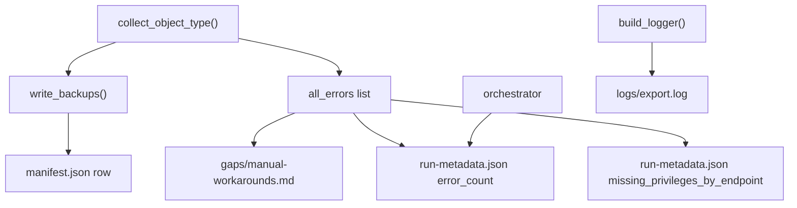

# manifest/, gaps/, and logs/

## manifest/

**Path:** `output/manifest/`

Inventory and run statistics for the export.

### manifest.json

**Produced by:** `manifest.write_manifest()`

JSON array of export records. Each element matches `ExportRecord` dataclass:

| Field | Type | Description |
|-------|------|-------------|
| `object_type` | string | Jamf object class |
| `jamf_id` | string | Object ID |
| `name` | string | Display name |
| `source_endpoint` | string | Detail or list API path template |
| `method` | string | HTTP method (GET) |
| `output_format` | string | `xml` or `json` |
| `file_path` | string | Path to backup file |
| `checksum_sha256` | string | SHA-256 of backup file content |
| `exported_at_utc` | string | ISO 8601 UTC timestamp |
| `status` | string | `success` (default) |
| `error` | string \| null | Error message if failed |

Use for: audit trails, integrity verification, restore planning.

### manifest.csv

Same data as `manifest.json` in CSV format for spreadsheet analysis.

### run-metadata.json

**Produced by:** `orchestrator.write_run_metadata()`

Run-level summary:

```json
{
  "exported_at_utc": "2026-06-01T03:46:36.253141+00:00",
  "exporter_version": "0.1.0",
  "total_objects_exported": 178,
  "object_counts": {
    "policies": 72,
    "scripts": 42
  },
  "error_count": 1,
  "missing_privileges_by_endpoint": {
    "/JSSResource/categories": ["categories"]
  }
}
```

| Field | Description |
|-------|-------------|
| `exporter_version` | Hardcoded in orchestrator (`0.1.0`) |
| `total_objects_exported` | Count of manifest records |
| `object_counts` | Per-type success counts |
| `error_count` | Total collector/runtime errors |
| `missing_privileges_by_endpoint` | 401 errors grouped by API path |

Written even on auth failure (with empty records and auth error metadata).

---

## gaps/

**Path:** `output/gaps/`

### manual-workarounds.md

**Produced by:** `gaps.write_gap_report()`

Two sections:

#### Endpoint/Feature Gaps

Static gaps from `endpoint_registry.get_manual_gaps()`. Objects or settings that cannot be fully captured via public API. Each entry includes:

- `object_type`
- `reason`
- `workaround` (manual steps)
- `source` (documentation reference)

#### Runtime Export Errors

Dynamic errors from the current run:

```
- `categories` `/JSSResource/categories`: List request failed with status 401
```

If no gaps and no errors: file contains `No gaps detected.`

---

## logs/

**Path:** `output/logs/`

### export.log

**Produced by:** `logging_utils.build_logger()`

- Format: `YYYY-MM-DDTHH:MM:SSZ LEVEL jamf_exporter MESSAGE`
- Also mirrored to stdout during export
- Secrets redacted via `RedactingFormatter` (Bearer tokens, passwords, client_secret)

Typical log entries:

| Level | Example |
|-------|---------|
| INFO | `Collected 72 objects for policies` |
| WARNING | `Token may be stale. Refreshing once for path=...` |
| WARNING | `Request retry path=... status=503 attempt=2/4 wait=4s` |
| WARNING | `Stopping early due to --stop-on-401 after object_type=categories` |
| WARNING | `Missing privileges summary (401 by endpoint):` |
| ERROR | `Authentication preflight failed: ...` |
| ERROR | `Collector failed for object_type=...` (with stack trace) |

Final line: `Export complete. exported=N errors=M output=...`

---

## Data Flow


