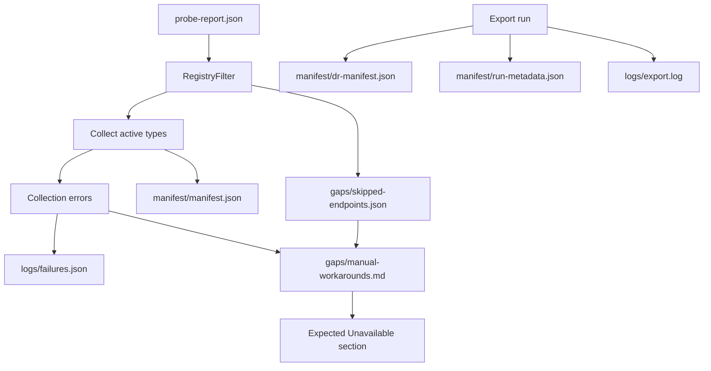

# manifest/, gaps/, and logs/

Inventory, skip taxonomy, and run logs in your backup folder.

## Data flow

## manifest/

| File | Purpose |
|------|---------|
| `manifest.json` | Full inventory with SHA-256 checksums per object |
| `manifest.csv` | Same data in CSV |
| `run-metadata.json` | Object counts, errors, missing privileges by endpoint |
| `dr-manifest.json` | DR bundle version, deployment mode, `tiers_completed` |
| `compatibility-spec.json` | Path compatibility metadata |

## gaps/

| File | Purpose |
|------|---------|
| `skipped-endpoints.json` | Endpoints skipped by RegistryFilter (expected, not failures) |
| `manual-workarounds.md` | **Expected Unavailable**, privilege gaps, runtime errors |
| `*-privilege-missing.md` | Per-tier privilege notes when inventory/FileVault blocked |

## logs/

| File | Purpose |
|------|---------|
| `export.log` | Detailed run log |
| `failures.json` | **Actionable** HTTP/collection failures only |

**Rule:** If an endpoint is in `skipped-endpoints.json`, it should **not** also appear in `failures.json`.

## Related

- [Output Directory](index.md)
- [Troubleshooting](../troubleshooting.md)
- [Export Engine](../export-engine.md)
