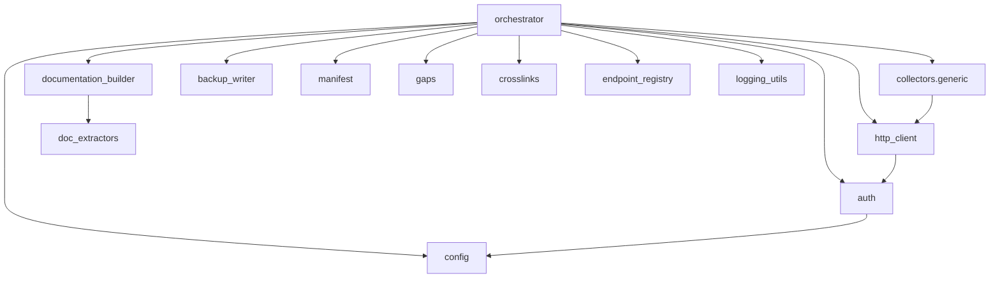
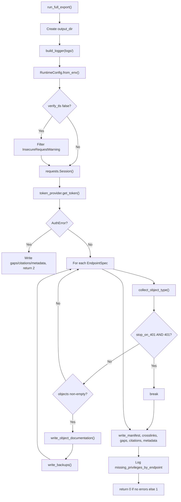

# jamf_exporter Package

**Path:** `jamf_exporter/`

Production Python package invoked by `scripts/run_full_export.py`. All modules are documented below with verified behavior from source.

## Package Map

---

## orchestrator.py

**Function:** `run_full_export(output_dir: Path, *, stop_on_401: bool = False) -> int`

Central orchestrator for the export pipeline.

### Execution Flow

### Helper Functions

| Function | Purpose |
|----------|---------|
| `_collect_missing_privileges(errors)` | Groups 401 errors by endpoint path |
| `write_endpoint_citations(output_root)` | Generates `documentation/api-endpoint-citations.md` |
| `write_run_metadata(...)` | Writes `manifest/run-metadata.json` |

---

## config.py

**Class:** `RuntimeConfig`

Loads all settings from environment variables via `RuntimeConfig.from_env()`.

| Field | Env Var | Validation |
|-------|---------|------------|
| `jamf_url` | `JAMF_URL` | Required; rejects placeholder URLs; strips trailing `/api` or `/JSSResource` |
| `verify_tls` | `JAMF_VERIFY_TLS` | Boolean, default `true` |
| `timeout_seconds` | `JAMF_TIMEOUT_SECONDS` | Default `60` |
| `max_retries` | `JAMF_MAX_RETRIES` | Default `3` |
| `retry_backoff_seconds` | `JAMF_RETRY_BACKOFF_SECONDS` | Default `2` |
| `client_id` | `JAMF_CLIENT_ID` | Optional |
| `client_secret` | `JAMF_CLIENT_SECRET` | |
| `username` | `JAMF_USERNAME` | |
| `password` | `JAMF_PASSWORD` | |
| `allow_restore` | `JAMF_ALLOW_RESTORE` | Default `false` |

Raises `ValueError` if `JAMF_URL` is missing or appears to be a placeholder.

---

## auth.py

**Classes:** `AuthError`, `JamfTokenProvider`

### Token Issuance Order

1. OAuth client credentials if `client_id` and `client_secret` are set
2. Basic-to-token if OAuth fails or is not configured
3. `AuthError` if both paths fail

### OAuth Details

- Endpoint: `POST {JAMF_URL}/api/v1/oauth/token`
- First attempt: HTTP Basic auth with client_id/secret
- Second attempt (on non-200): client_id/secret in form body
- Token cached until 1 minute before expiration

### Basic Fallback

- Endpoint: `POST {JAMF_URL}/api/v1/auth/token`
- HTTP Basic auth with username/password

### Error Rendering

`_render_auth_error()` detects CloudFront HTML error pages and adds URL/WAF hints for 401/403.

---

## http_client.py

**Class:** `JamfApiClient`

Wraps authenticated HTTP requests with retry logic.

| Behavior | Detail |
|----------|--------|
| Authorization | `Bearer {token}` on every request |
| 401 handling | Clears cached token once and retries |
| 5xx handling | Retries up to `max_retries + 1` attempts with linear backoff |
| URL construction | `{jamf_url}{path}` |

---

## endpoint_registry.py

Defines `EndpointSpec` entries and manual gap records.

### EndpointSpec Fields

| Field | Description |
|-------|-------------|
| `object_type` | Directory name and manifest key |
| `api_family` | `classic_api` (XML) or `jamf_pro_api` (JSON) |
| `method` | HTTP method (all current specs use `GET`) |
| `list_path` | List-all endpoint |
| `detail_path` | Per-ID endpoint with `{id}` placeholder, or `None` for singleton endpoints |
| `reference_url` | Official Jamf documentation URL |
| `citation` | Human-readable citation string |
| `verified` | Whether endpoint was confirmed against docs |

### Functions

| Function | Returns |
|----------|---------|
| `get_endpoint_specs()` | List of 27 `EndpointSpec` objects |
| `get_manual_gaps()` | List of `GapRecord` for non-API-exportable features |
| `OFFICIAL_SOURCES` | Tuple of official Jamf doc URLs |

---

## collectors/generic.py

**Function:** `collect_object_type(client, spec, logger) -> tuple[list[dict], list[dict]]`

### Flow

1. GET `list_path` with Accept header matching API family
2. On status ≥ 400: record error (includes `status_code` as string) and return empty objects
3. Parse IDs from XML (`//id` elements) or JSON (`results`/`items` arrays)
4. If `detail_path` is `None`: return single-object list from list response
5. For each ID: GET detail, build object dict
   - Classic API: `{id, name, raw_xml}`
   - Jamf Pro API: JSON dict with `id` injected if missing
6. Detail failures are logged as errors but do not stop other IDs

---

## documentation_builder.py

**Function:** `write_object_documentation(root, spec, objects)`

Creates:

- `documentation/{object_type}/README.md` — type summary with endpoint info and object count
- `documentation/{object_type}/{id}__{safe_name}.md` — per-object doc

Per-object file structure:

1. `# {object_type} / {id}` heading
2. **Extracted Summary** — JSON from `doc_extractors.summarize_xml_object()` for Classic API objects; empty `{}` for JSON-only objects without XML
3. **Raw Object** — JSON block containing normalized payload (`raw_xml` key for Classic API)

Before writing, deletes stale `*.md` files in the type directory except `README.md`.

Filename sanitization: non-alphanumeric characters → `_`, max 120 chars.

---

## doc_extractors.py

**Function:** `summarize_xml_object(object_type, raw_xml) -> dict`

Extracts type-specific fields from Classic API XML:

| Object Type | Extracted Fields |
|-------------|------------------|
| All | `id`, `name` |
| `policies` | enabled, triggers, frequency, scope targets/exclusions, scripts, packages |
| `computer_groups`, `mobile_device_groups` | is_smart, criteria, members |
| `*_configuration_profiles` | uuid, distribution_method, user_removable |
| `scripts` | language, filename, parameter4 |
| `packages` | category, filename, priority |
| `computer_extension_attributes` | data_type, input_type |

Returns `{"parse_error": "invalid_xml"}` on XML parse failure.

---

## backup_writer.py

**Function:** `write_backups(root, spec, objects) -> list[ExportRecord]`

Writes to `backup/{object_type}/{id}__{safe_name}.{xml|json}`:

- Classic API → `.xml` with raw XML content
- Jamf Pro API → `.json` with indented sorted JSON

Computes SHA-256 checksum and returns `ExportRecord` list for manifest.

---

## manifest.py

**Function:** `write_manifest(root, records)`

Writes:

- `manifest/manifest.json` — JSON array of `ExportRecord.__dict__`
- `manifest/manifest.csv` — Same data with CSV headers from dataclass fields

---

## gaps.py

**Function:** `write_gap_report(root, gaps, runtime_errors)`

Writes `gaps/manual-workarounds.md` with:

- **Endpoint/Feature Gaps** — from `get_manual_gaps()` (static registry gaps)
- **Runtime Export Errors** — from collector failures during the run

---

## crosslinks.py

**Function:** `write_crosslink_report(output_root, collected_by_type)`

Writes `documentation/crosslinks.md` analyzing policy XML to map:

- Scripts → Policies
- Packages → Policies
- Categories → Objects (policy references only)

Only processes objects in `collected_by_type["policies"]` with valid `raw_xml`.

---

## logging_utils.py

**Function:** `build_logger(log_dir) -> logging.Logger`

- Logger name: `jamf_exporter`
- Level: INFO
- Handlers: file (`logs/export.log`) + stdout
- `RedactingFormatter` masks Bearer tokens, client_secret, and password values in log output

---

## types.py

Dataclasses:

| Class | Purpose |
|-------|---------|
| `EndpointSpec` | Immutable endpoint definition |
| `ExportRecord` | Manifest row with checksum, timestamps, status |
| `GapRecord` | Manual workaround entry |

---

## restore/safe_restore.py

Restore scaffolding (not a full restore implementation).

| Function | Behavior |
|----------|----------|
| `load_manifest(path)` | Parse manifest JSON |
| `validate_restore_preconditions(config, dry_run)` | Raises `PermissionError` if non-dry-run and `allow_restore` is false |
| `restore_from_manifest(...)` | Dry-run: returns "DRY_RUN would restore..." strings; non-dry-run: returns "RESTORE_PENDING..." placeholders |

Supports `allow_object_types` filter set.

---

## collectors/__init__.py

Re-exports `collect_object_type` from `collectors.generic`.

---

## Related

- [run_full_export.py](run-full-export.md)
- [Output documentation](../output/index.md)
- [Architecture](../architecture.md)
