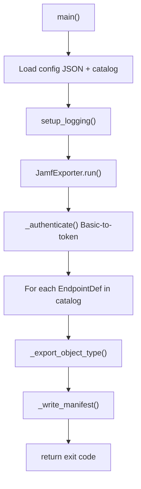
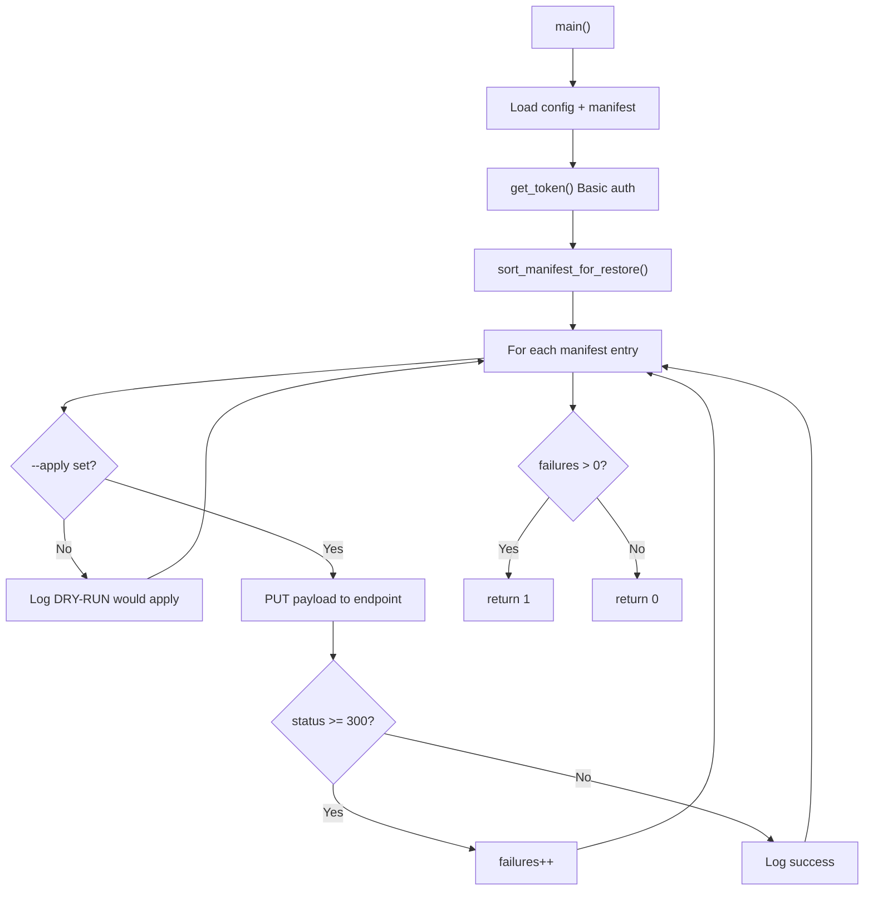

# Legacy Tools

Two standalone scripts in `src/` predate the `jamf_exporter` package. They use JSON configuration and urllib instead of the production env-based pipeline.

## When to Use

| Tool | Use Case |
|------|----------|
| `src/jamf_audit_exporter.py` | Reference only; production path is `scripts/run_full_export.py` |
| `src/jamf_restore.py` | Experimental restore from legacy manifest format |

---

## src/jamf_audit_exporter.py

**Purpose:** Original Phase 1 (documentation) + Phase 2 (backup) exporter using JSON config and endpoint catalog.

### Arguments

| Flag | Required | Default | Description |
|------|----------|---------|-------------|
| `--config` | Yes | — | Path to JSON config (e.g. `config/jamf_config.example.json`) |
| `--catalog` | No | `config/endpoint_catalog.json` | Endpoint catalog JSON |
| `--output` | No | `output` | Output root directory |
| `--verbose` | No | off | DEBUG logging |

### Config JSON Fields

Read from config file (not environment):

| Key | Description |
|-----|-------------|
| `jamf_url` | Jamf Pro base URL |
| `username` | API username |
| `password` | API password |
| `verify_tls` | TLS verification (default `true`) |
| `request_timeout_seconds` | HTTP timeout (default `60`) |
| `max_retries` | Retry count (default `3`) |
| `retry_backoff_seconds` | Backoff (default `2`) |
| `export_format` | Export format preference (default `json`) |
| `include_xml_for_classic` | Include XML for Classic API (default `true`) |

### Authentication

Basic-to-token only via `POST /api/v1/auth/token`. No OAuth client credentials support.

### Output Layout (Legacy)

Differs from production exporter:

| Legacy Path | Production Equivalent |
|-------------|----------------------|
| `output/docs/` | `output/documentation/` |
| `output/raw/` | `output/backup/` |
| Manifest in exporter output | `output/manifest/manifest.json` |

### Execution Flow



### Example

```bash
python src/jamf_audit_exporter.py \
  --config config/jamf_config.example.json \
  --catalog config/endpoint_catalog.json \
  --output output \
  --verbose
```

### Error Handling

- Missing config/catalog: `FileNotFoundError`
- Uncaught exceptions: logged and exit code `1`
- Per-endpoint failures appended to `self.failures` list

---

## src/jamf_restore.py

**Purpose:** Restore utility reading a manifest and optionally applying PUT requests.

### Arguments

| Flag | Required | Default | Description |
|------|----------|---------|-------------|
| `--config` | Yes | — | JSON config with `jamf_url`, credentials |
| `--manifest` | Yes | — | Path to manifest JSON |
| `--output-log` | No | `output/logs/restore.log` | Restore log file |
| `--apply` | No | off | Execute PUT restores (default is dry-run) |

### Behavior



### Restore Ordering

`sort_manifest_for_restore()` orders by dependency:

categories → sites → buildings → departments → packages → scripts → groups → profiles → policies

### Payload Resolution

Resolves backup file as: `manifest_path.parent.parent / file_rel` where `file_rel` is the `filename` field in manifest entries.

**Note:** Production `manifest.json` uses `file_path` (absolute or output-relative), not `filename`. Legacy restore may not work directly with production manifests without field mapping.

### Example

```bash
# Dry-run (default)
python src/jamf_restore.py \
  --config config/jamf_config.example.json \
  --manifest output/manifest/manifest.json

# Apply (destructive — use with caution)
python src/jamf_restore.py \
  --config config/jamf_config.example.json \
  --manifest output/manifest/manifest.json \
  --apply
```

---

## Production Restore Scaffolding

See `jamf_exporter/restore/safe_restore.py` in [jamf_exporter Package](jamf-exporter-package.md). Non-dry-run restore is intentionally not implemented (`RESTORE_PENDING`).
