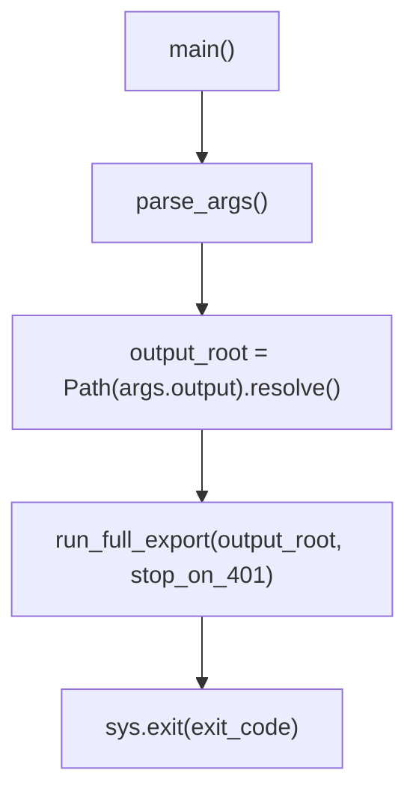

# run_full_export.py

**Path:** `scripts/run_full_export.py`

Primary CLI entrypoint for the Jamf Settings Analysis export pipeline.

## Purpose

Parses command-line arguments and delegates to `jamf_exporter.orchestrator.run_full_export()`.

## Arguments

| Argument | Type | Default | Description |
|----------|------|---------|-------------|
| `--output` | string | `output` | Root directory for documentation, backup, manifest, gaps, and logs |
| `--stop-on-401` | flag | off | Stop collection on first HTTP 401 response |

## Execution Flow



## Dependencies

- `jamf_exporter.orchestrator.run_full_export`
- Environment variables loaded inside orchestrator via `RuntimeConfig.from_env()`

## Example Commands

```bash
# Standard full export
python scripts/run_full_export.py --output output

# Custom output location
python scripts/run_full_export.py --output /tmp/jamf-export

# Fail fast on first permission error
python scripts/run_full_export.py --output output --stop-on-401
```

## Error Handling

The script does not catch exceptions. Auth failures and unexpected errors propagate from the orchestrator. Auth preflight failures return exit code `2`; partial API failures return exit code `1`.

## Related

- [jamf_exporter Package](jamf-exporter-package.md)
- [Architecture](../architecture.md)
- [Usage Guide](../usage-guide.md)
