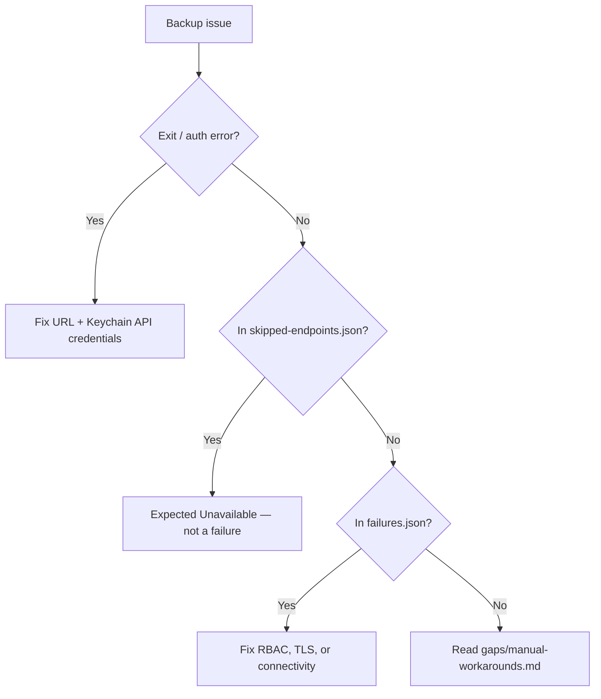

# Troubleshooting

Common Jamf Dossier backup issues. Verified against shipped export behavior (v0.4.0+).

## Triage flow

## Authentication failures

### Symptom

Backup fails immediately; no objects collected.

### Fixes

| Cause | Fix |
|-------|-----|
| Wrong Jamf Pro URL | Use exact URL including port for on-prem (e.g. `https://host:8443`) |
| API credentials not in Keychain | Save OAuth client ID/secret or username/password in **Settings** |
| OAuth client disabled | Regenerate secret in Jamf Pro → API Roles and Clients |
| TLS / network | Toggle **Verify TLS** off only for lab self-signed certs; check VPN/firewall |

**Note:** SSH credentials authenticate server tools only — they do **not** satisfy Jamf Pro HTTPS API auth.

## HTTP 401 on specific object types

Some types export; others fail.

1. Jamf Pro → **Settings → System Settings → API Roles and Clients**
2. Grant **Read** for failing resources
3. Enable **Stop on first 401** to locate the first missing privilege
4. Check `manifest/run-metadata.json` → `missing_privileges_by_endpoint`

## TLS certificate errors

Toggle **Verify TLS certificates** off in Settings only for lab appliances with self-signed certificates.

## Expected unavailable endpoints (not failures)

As of v0.4.0, **RegistryFilter** skips known platform gaps before collection. Skipped types appear in `gaps/skipped-endpoints.json` and **Expected Unavailable** in `gaps/manual-workarounds.md`. They do **not** belong in `logs/failures.json`.

| Symptom | Typical cause | Action |
|---------|---------------|--------|
| JCDS skipped on on-prem | JCDS 2.0 is cloud-only | Enable package binaries via on-prem SSH in Settings |
| Endpoint skipped after probe | 404 on your Jamf version | Expected — document manually if needed |
| Cloud-only type on on-prem | Registry `cloud_only` flag | No action unless Jamf adds API support |

## Package binaries empty (on-prem)

Enable **full DR tiers** in Settings and configure SSH host, username, and Keychain password or private key. See [Operator Guide](jamf-dossier-operator-guide.md).

## Inventory / FileVault gaps

Grant **Computers: Read** and **View Disk Encryption Recovery Key** on the API role. Gap notes appear under `gaps/` when privileges are missing.

## Empty documentation summaries

Re-run backup after upgrading to v0.4.0+. Per-object markdown includes Plain Text sections when Classic API detail responses are complete.

## Related

- [Getting Started](getting-started.md)
- [Operator Guide](jamf-dossier-operator-guide.md)
- [Manifest, gaps, logs](output/manifest-gaps-logs.md)
- [Export Engine](export-engine.md)
