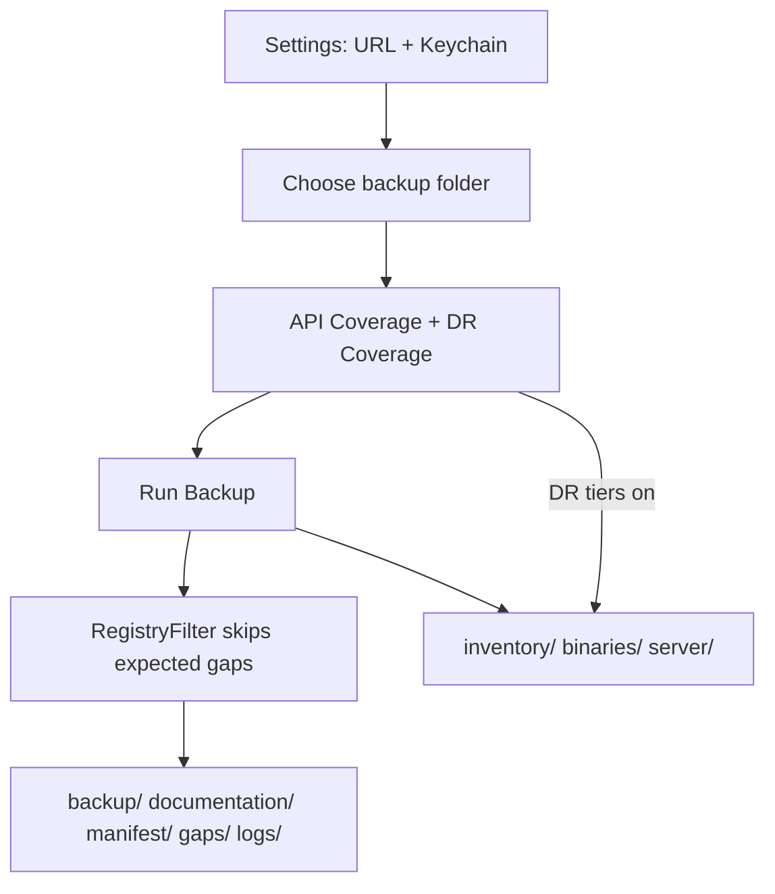

# Usage Guide

Run backups, interpret output, and enable DR tiers in **Jamf Dossier**.

## App export flow

## Standard backup

1. Open **Jamf Dossier** → choose destination folder
2. Leave **Backup all** enabled (or select object types)
3. Click **Run Backup**
4. Review `manifest/run-metadata.json` and `gaps/manual-workarounds.md`

## DR tiers

Enable in **Settings** / **DR Coverage** when your deployment supports them:

| Tier | Output |
|------|--------|
| Inventory | `inventory/` |
| Package binaries | `binaries/` |
| MySQL / Tomcat / SSH | `server/` |

On-prem package binaries require SSH credentials. Cloud uses JCDS URLs.

## Stop on first 401

Enable **Stop on first 401** to fail fast while tuning API role privileges. Partial export still writes manifest and gaps.

## Re-runs

Safe to re-run; manifests and documentation regenerate each time. Use timestamped subfolders to keep history.

## Review checklist

| Path | Check |
|------|-------|
| `gaps/skipped-endpoints.json` | Expected skips (not failures) |
| `logs/failures.json` | Actionable errors only |
| `manifest/dr-manifest.json` | `tiers_completed` |
| `documentation/` | Plain Text sections present |

## Related

- [Getting Started](getting-started.md)
- [Operator Guide](jamf-dossier-operator-guide.md)
- [Output Directory](output/index.md)
- [Troubleshooting](troubleshooting.md)
